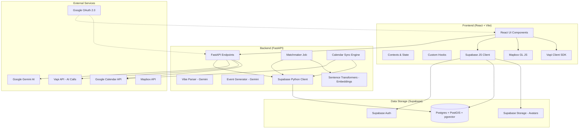

# Repository Architecture

The project follows a monorepo structure with a React frontend and a FastAPI backend, both communicating with Supabase for data persistence and authentication.

## Component Descriptions

| Component | Responsibility |
|-----------|----------------|
| **Frontend** | React single-page application handling user interface, onboarding, and dashboard. |
| **Backend** | FastAPI server handling business logic, AI integrations, and background jobs. |
| **Supabase** | Backend-as-a-Service providing authentication, database, and storage. |
| **Google Gemini** | AI model used for parsing user vibes and generating event suggestions. |
| **Vapi** | Platform for placing AI-powered voice calls to businesses for reservations. |
| **Mapbox** | Map visualization for event locations and user geolocation. |
| **Google Calendar** | Source of user availability for the matchmaker. |
| **Sentence Transformers** | Used locally in the backend to generate vector embeddings for user matching. |
