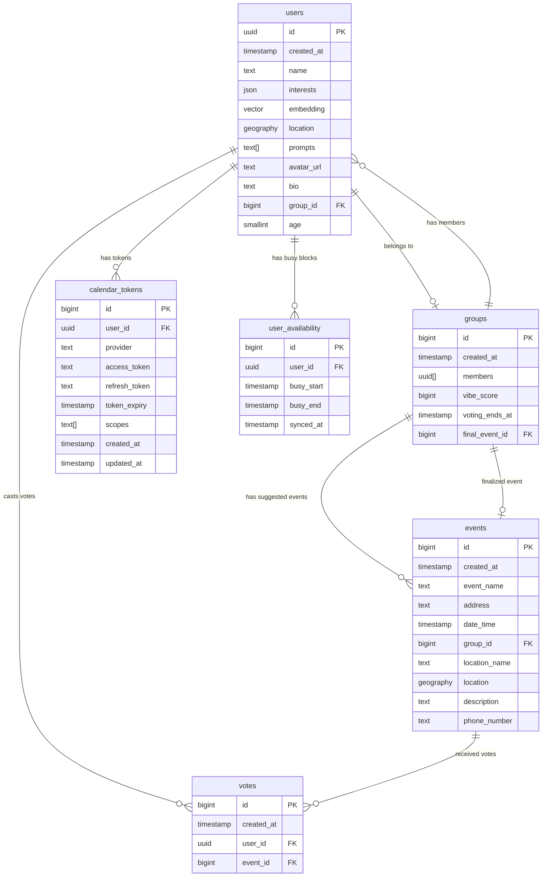

# Database Schema (ERD)

The database is hosted on Supabase (PostgreSQL) and uses PostGIS for location data and `pgvector` for user embeddings.

## Table Descriptions

| Table | Description |
|-------|-------------|
| **users** | Core user profiles, including preferences, embeddings for matching, and geolocation. |
| **groups** | Formed groups of compatible users, tracking member IDs and voting status. |
| **calendar_tokens** | OAuth tokens for Google Calendar access. |
| **user_availability** | Synced busy blocks from Google Calendar, used for time-based matching. |
| **events** | Suggested and finalized events for each group. |
| **votes** | Individual user votes for suggested events within their group. |
| **geography_columns / geometry_columns / spatial_ref_sys** | PostGIS internal tables for spatial data support. |
