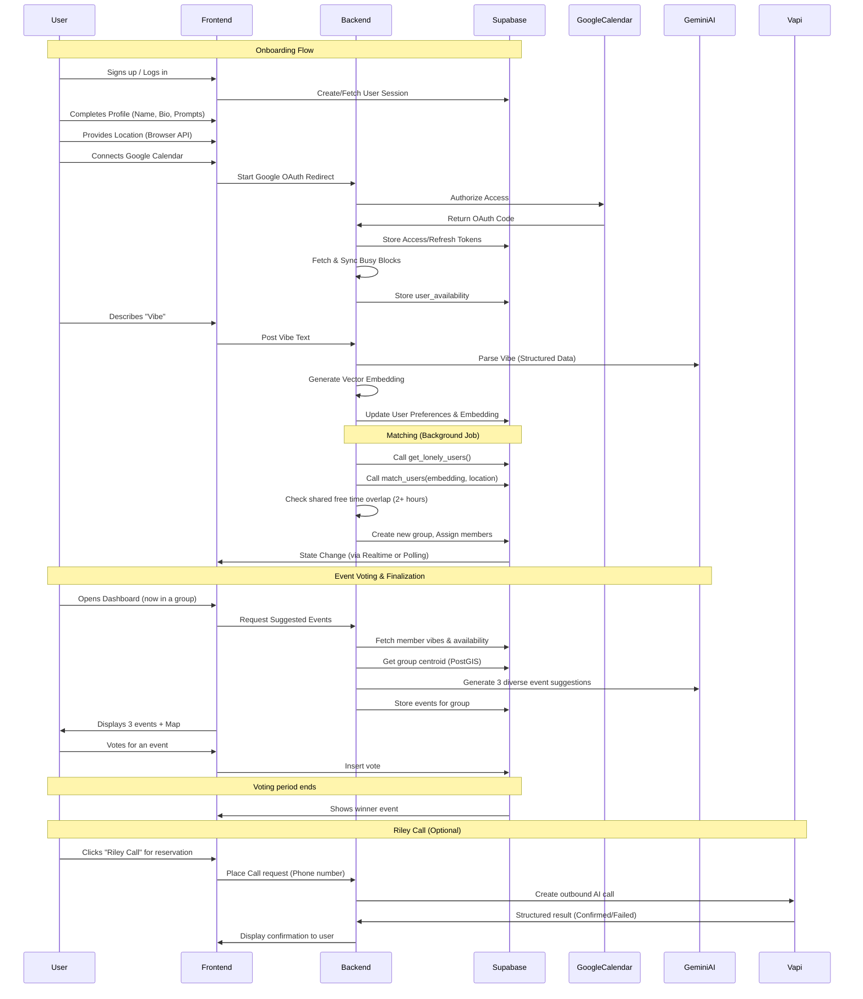

# User Flow

The user journey in Connect spans from onboarding to event selection and reservation.

## Step-by-Step Breakdown

### 1. Onboarding
- **Identity & Profile:** Users create their identity and provide social prompts for matching.
- **Location & Calendar:** Critical for the matchmaker to ensure users are nearby and share free time.
- **Vibe Parsing:** Gemini AI structures free-form text into attributes like activity types, budget, and alcohol preference.

### 2. Matchmaker Job
- **Vector Search:** Uses `pgvector` to find users with similar interests.
- **Geospatial Filter:** Uses PostGIS to ensure users are within a reasonable radius (e.g., 20 miles).
- **Time Filter:** A critical backend check ensuring all group members share a 2-hour free window in the next 7 days.

### 3. Group Dashboard
- **Group Formation:** Users are notified once they are placed in a small group (3–4 people).
- **Event Selection:** The backend generates 3 tailored events near the group's centroid based on shared vibes and availability.
- **Voting:** Group members vote on their preferred activity.

### 4. Reservation (Riley Call)
- **AI-Powered:** Riley (the Vapi agent) calls the venue directly to confirm availability or make a reservation, returning a structured summary to the group.
