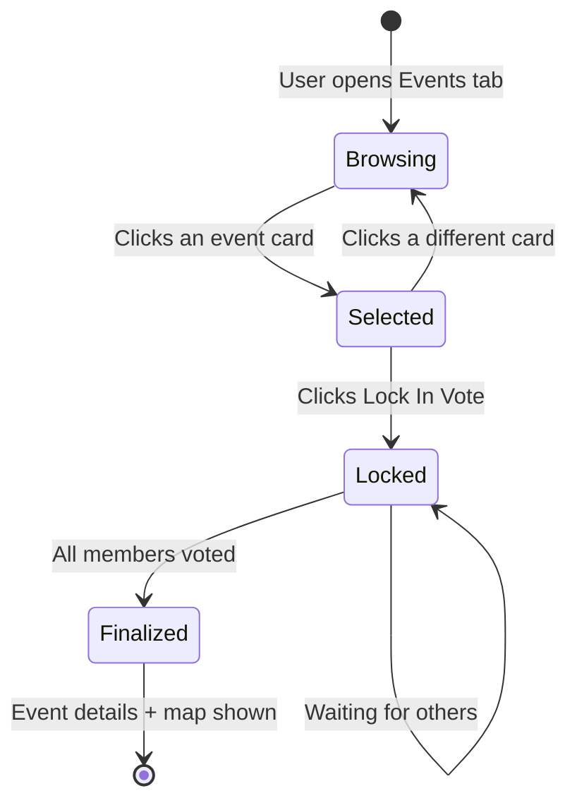

# Events Voting Overhaul

## Data Model Changes

### Mock data (`[src/data/mockData.ts](src/data/mockData.ts)`)

- Add a `voters` array to each `MockEvent`: list of `{ id, name, avatarUrl }` representing users who locked in that event
- Add `MOCK_CURRENT_USER_ID` constant so the UI knows who "you" are
- Add a `currentUserVote` field (event ID or null) to represent the locked-in state
- Keep existing `MockMember` shape (already has `id`, `name`, `avatarUrl`)

### Interests structure (no changes needed)

The `MockEvent` interface gains `voters: { id: string; avatarUrl: string }[]` -- the `votes` count and `userVoted` boolean are removed since they become derived.

## Component Changes

### 1. `EventsSidebar` (`[src/components/dashboard/EventsSidebar.tsx](src/components/dashboard/EventsSidebar.tsx)`) -- full rewrite

**Before:** Upvote/downvote toggle per event, local vote counts.

**After:**

- Accept props: `events`, `selectedId`, `onSelect`, `lockedEventId`
- Each event card is **clickable to select** (highlights with a purple border + subtle glow)
- Remove the upvote button and vote count column
- Add a **voter avatars row** at the bottom of each event card: small circular avatar images (24px) of users who voted for that event, with a `+N` overflow if more than 4
- If the current user has locked in this event, show a checkmark badge on the card
- When `lockedEventId` is set, dim/mute all other cards so the user's choice stands out

### 2. `EventsTab` (`[src/components/dashboard/EventsTab.tsx](src/components/dashboard/EventsTab.tsx)`) -- orchestrator rewrite

State management:

- `selectedId: string | null` -- which event card is highlighted (pre-lock)
- `lockedEventId: string | null` -- the user's final vote (post-lock, persisted to Supabase)
- `allVoted: boolean` -- derived: true when every group member has a vote

Flow:

```
User selects event --> card highlights
    |
    v
"Lock In Vote" button appears at bottom
    |
    v
User clicks lock-in --> supabase.from('votes').insert({ group_id, user_id, event_id })
    |
    v
lockedEventId is set, cards update visually, lock-in button replaced with "Vote locked!" confirmation
    |
    v
If all members voted --> transition to finalized view
```

Three visual states:

1. **Voting (no lock):** sidebar + map side-by-side, event cards selectable, "Lock In Vote" button appears when one is selected
2. **Vote locked:** sidebar shows the user's choice highlighted with a confetti/check animation, other cards are muted, button says "Vote Locked" (disabled)
3. **All voted / finalized:** full-width map centered on the winning event, event details banner at top of page

### 3. `EventsMap` (`[src/components/dashboard/EventsMap.tsx](src/components/dashboard/EventsMap.tsx)`) -- add props

- Accept optional `highlight` event ID to visually emphasize one marker
- Accept optional `fullScreen` boolean that makes the map take the full container width and increases min-height
- When in finalized mode, show only the winning event marker (larger, with a label)

### 4. `FinalEventCard` (`[src/components/dashboard/FinalEventCard.tsx](src/components/dashboard/FinalEventCard.tsx)`) -- redesign

Currently a standalone card. Change to a **top banner** layout:

- Horizontal bar at the top with: celebration badge, event name, venue, date/time, address
- Sits above the full-width map
- Keep the existing data shape, just change the visual layout

### 5. New "Lock In Vote" button area

Part of `EventsTab`, rendered below the sidebar:

- Primary gradient button: "Lock In Vote"
- Only visible when `selectedId` is set and `lockedEventId` is null
- Shows a loading spinner during the Supabase insert
- After success, transitions to a "Vote Locked" state with a check icon

## CSS Changes (`[src/components/dashboard/Dashboard.module.css](src/components/dashboard/Dashboard.module.css)`)

New classes needed:

- `.eventCardSelected` -- purple border, subtle purple glow shadow, slight scale-up
- `.eventCardLocked` -- green check overlay or badge
- `.eventCardMuted` -- reduced opacity when user has locked a different event
- `.voterAvatars` -- flex row of small circular images
- `.voterAvatar` -- 24px circle with border
- `.voterOverflow` -- "+N" badge
- `.lockInArea` -- sticky bottom bar for the lock-in button
- `.lockInBtn` / `.lockInBtnLocked` -- button states
- `.finalizedBanner` -- top banner for the chosen event in finalized view
- `.finalizedMapWrap` -- full-width map container
- `.confettiCheck` -- animation for the lock-in confirmation

## Supabase Integration

The lock-in button calls:

```typescript
await supabase.from('votes').insert({
  group_id: currentGroupId,
  user_id: currentUserId,
  event_id: selectedId,
})
```

The "all voted" check compares `votes.length` for the group against `group_members.length`. For now this uses mock data counts, but is structured so the real query can drop in later.

## Visual Flow Diagram




